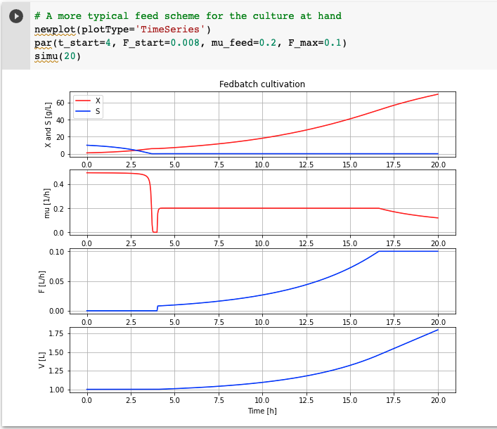

# BPL_TEST2_Fedbatch

Basic example of fedbatch cultivation using an FMU from Bioprocess Library. Below script and diagram with a typical simulations of fedbatch growth that you will get at the end of the notebook.

You start up the notebook in Colab by pressing here
[start BPL notebook](https://colab.research.google.com/github/janpeter19/BPL_TEST2_Fedbatch/blob/main/BPL_TEST2_Fedbatch_with_PyFMI_274_py_3713_v1.ipynb).
Then you in the menu choose Runtime/Run all.

The installation takes just a few minutes. The subsequent execution of the simulations of microbial growth take just a second or so. You can continue in the notebook and make new simulations and follow the examples given.

Note that:
* The script occassionaly get stuck during installation. Then just close the notebook and start from scratch.
* Runtime warnings are at the moment silenced. The main reason is that we run witl an older combination of PyFMI and Python that bring depracation warnings of less interest.
* Remember, you need to have a google-account!

Just to be clear, no installation is done at your local computer.
